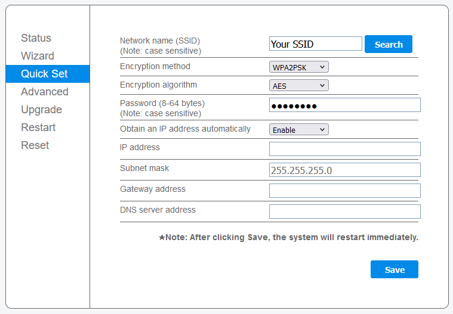
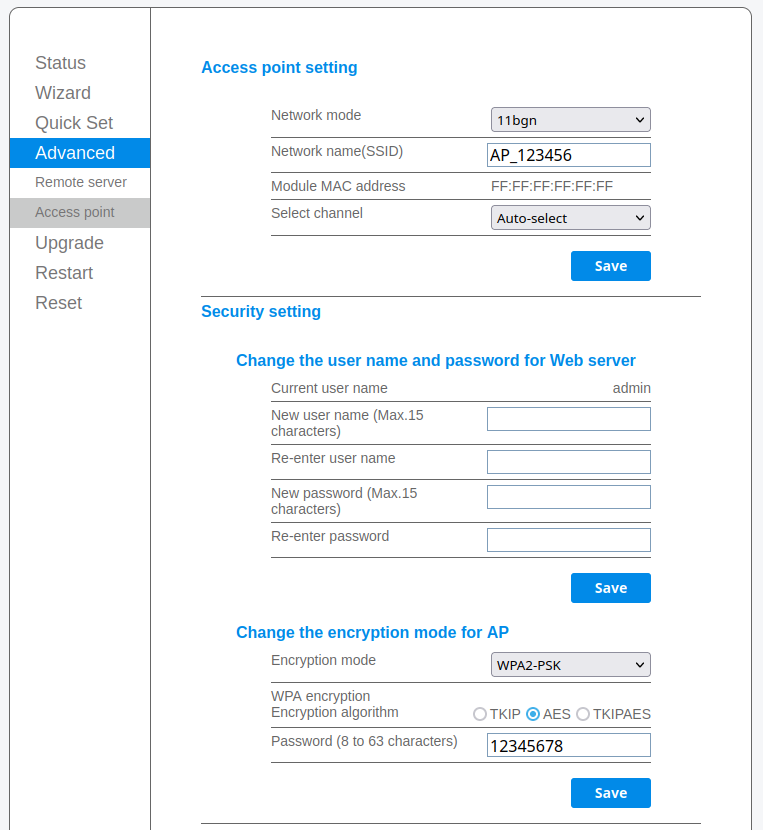
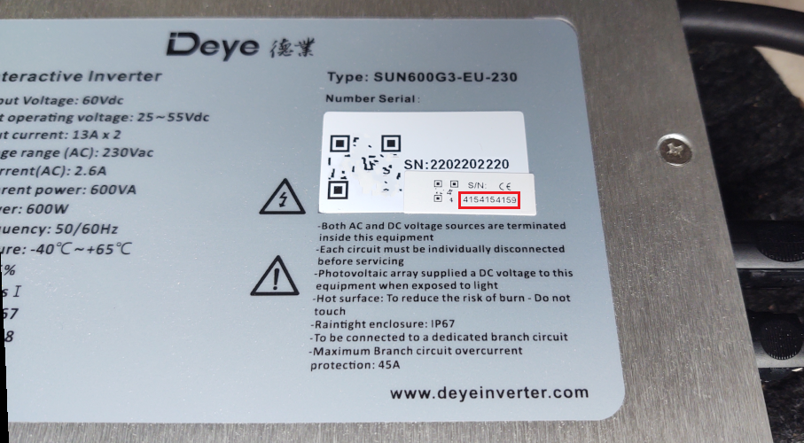
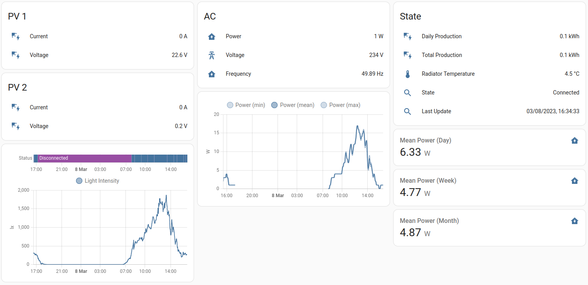
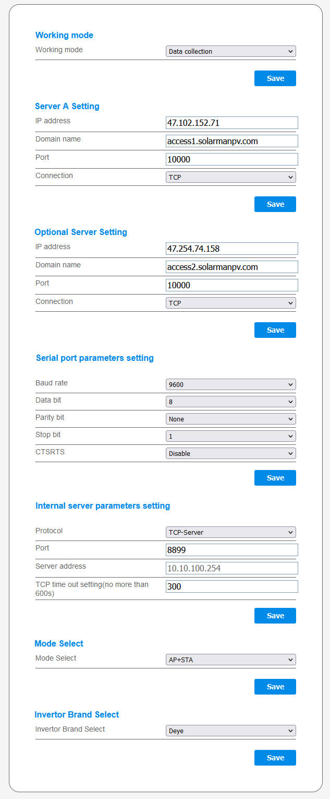

# Deye Microinverter - Cloud-free


Solar power generation work best if there are no clouds anywhere to be seen :)
<br/><br/>

This repository aims to document how to use Deye microinverters entirely local only and cloud free.
It consolidates the knowledge that at the time of writing was spread over hundreds of different posts, issues and comments.

Furthermore, it also features a cloud replacement implementation so you won't have to install any apps or create any accounts.
You also won't have to share any e-mail address or phone number.

## Devices

So far, the following devices are known to work like this:

- Deye SUN600G3-EU-230
- Deye SUN-M80G3-EU-Q0
- Deye SUN-M80G4-EU-Q0

it should also be the same for other inverters of the same series including rebrands such as Bosswerk.<br/>
If you have verified that it works with another device, feel free to extend this list.

## TL;DR

Here are the main things you will want to know about these microinverters:

- They have Wi-Fi
- They can be connected to Wi-Fi networks via their webinterface
- They can operate without an internet connection
- They can operate without an account
- They can be monitored and controlled via their local ModbusTCP interface
- You can also completely replace the cloud with a local implementation: [dummycloud](./dummycloud)

**2024-08-20 Update**

Deye has started rolling out firmware updates for the logger that block both ModbusTCP access and prevent the mock cloud
from working due to the introduction of TLS. Fortunately, for now it seems that newly bought inverters still come with older
logger firmwares that work offline.
Also equally fortunately, it seems that downgrading the firmware is possible as well.

However, both of these things may change in the future.

## Preamble

Compared to traditional PV setups where a single large inverter is connected to strings of many PV Panels, in a microinverter Setup, you have one small inverter for every 1-4 PV Panels.

There are up- and downsides to both of these topologies but that is for now out of scope for this document.
What you need to know is that microinverters are cheaper and scaled-down versions of their larger brothers.

Because they only cost 150-200€ they make getting into solar power generation accessible for many more people than ever before.
Paired with two PV Panels you're looking at an investment of at most 1000€ to get free energy from the sun.

Additionally, because you only need few panels for the setup to make sense financially, often a balcony or garden can be enough for a small solar setup.
This is especially interesting for people living in rental properties.

### Word of warning

After reading through way too many concerning posts and comments, here's what has to be said:

**Please** please please don't cut any corners when it comes to safety-critical stuff such as cabling and also mounting panels.
You don't want your home to burn down or anyone to be killed by a falling 1.5m² 25kg PV Panel.

Electricity is dangerous. So are heavy things with a huge attack surface for wind.<br/>
When in doubt, contact a local electrician. They know what they're doing and will help you.

## Setup

Now with that out of the way, we can talk about what to do.

The first important thing to note is that these inverters will shut down if they don't sense at least 20V on at least one PV input.
This means that you have to do all this during the day connected while connected to a PV panel.

Alternatively, some people reported that they got the inverter to wake up by connecting a 30V lab power supply to one of the PV inputs.

### Joining Wi-Fi

By default, your microinverter should provide a Wi-Fi Access point with an SSID named similarly to `AP_4151234567`.
Using a laptop, connect to that using the password printed on the AP or for older inverters the default password `12345678`.

In a browser, navigate to the IP of the inverter in that network which should by default be `http://10.10.100.254/`.
Log in to the webinterface with the default credentials `admin:admin` and use that to configure Wi-Fi.



The AP-mode can be a bit unstable so prepare for the webinterface stopping to work occasionally.
Once the inverter is connected to you Wi-Fi, this should not be an issue anymore.


### Ensuring a patched logger firmware

After joining the inverter to you Wi-Fi network, connect to the webinterface again but this time using the IP in your network.

Now, expand the `Device Information` on the `Status` page and ensure that your logger firmware version is at least `MW3_16U_5406_1.53` or newer.


Older firmwares don't allow reconfiguration of the Wi-Fi AP, which is a serious vulnerability, as it allows an attacker to easily gain access to your real Wi-Fi credentials.

If your firmware is older, you can find firmware update files in this repo: [https://github.com/dasrecht/deye-firmware](https://github.com/dasrecht/deye-firmware).
You can flash them using the `Upgrade Firmware` page of the webinterface.


### Securing the AP

With the logger firmware upgraded, you should now use the webinterface to change SSID and Password for the AP of the inverter.



Pick something not immediately obvious and relatively secure as - as mentioned before - it is all that prevents an attacker from connecting to that AP and reading out your main Wi-Fi credentials.

I have been told that you can also use the wizard to disable the AP entirely, however personally, I like having a fallback way into the inverter, especially since I did not see a "Factory Reset" button on the device.


### Configuring your network

Now that the AP is secured, use the configuration interface of your router to block internet access of the inverter.
You will also likely want to configure it, so that it will always get the same IP assigned via DHCP.

These things should be dropdowns and checkboxes in most consumer routers.
If you run some advanced setup, you will know what to do.

You can also try to DNS-block `access1.solarmanpv.com` and `access2.solarmanpv.com`, however it seems that the logger firmware might also use hardcoded IPs?
Either way, just blocking internet access entirely should be much easier in most setups anyway and comes with no known downsides.

## Usage

After connecting the inverter to your Wi-Fi network, securing it and blocking its internet access, all you need to do now is monitor and control it.

For this there are different options.

### Local polling
Most of the options rely on polling the local modbusTCP interface that uses the inverter logger serial number for authentication.

To get this serial, simply look at the sticker on the device:



If you feel like doing something arcane and/or want to build something for that yourself, you can find the Modbus spec for these inverters in the complementary assets repo:
[https://github.com/Hypfer/deye-microinverter-cloud-free-assets](https://github.com/Hypfer/deye-microinverter-cloud-free-assets).

Note that with internet access blocked, the inverter never receives any time information.
This breaks the `Yield today` counter as it will never properly reset unless you manually set the time on each boot using modbus register `22`, `23` and `24`.


#### With Home Assistant

With Home Assistant, the easiest way to get your inverter connected is by using [HACS](https://hacs.xyz/) to install the [Solarman](https://github.com/StephanJoubert/home_assistant_solarman) `custom_component`.
Please refer to the project documentation on how to install and configure those.

Home Assistant offers powerful tooling to store, visualize and process data right out of the box.

For example, here's how a solar dashboard could look like using mock data and only stock home assistant cards.
The real world will obviously look slightly different but the idea should be the same:




#### With other smarthome software

If you're using OpenHAB, FHEM, ioBroker or something else, as long as it can speak MQTT, you can use for example [https://github.com/kbialek/deye-inverter-mqtt](https://github.com/kbialek/deye-inverter-mqtt) to connect your inverter to your smarthome.

A `docker-compose.yml` entry for that tool could look like this:

```yaml
  deyetomqtt:
    image: ghcr.io/kbialek/deye-inverter-mqtt
    container_name: "deyetomqtt"
    environment:
      - LOG_LEVEL=DEBUG
      - DEYE_DATA_READ_INTERVAL=60
      - DEYE_METRIC_GROUPS=micro
      - DEYE_LOGGER_SERIAL_NUMBER=4151234567
      - DEYE_LOGGER_IP_ADDRESS=192.168.178.123
      - DEYE_LOGGER_PORT=8899
      - MQTT_HOST=192.168.178.2
      - MQTT_TOPIC_PREFIX=deye
      - MQTT_PORT=1883
    restart: always
```

Keep in mind that this might change in the future so make sure to always check the docs of the project itself.

### Using the dummycloud

If you don't want polling and/or are unhappy with having the inverter in a perpetual state of reconnection to the cloud,
you can instead deploy the cloud replacement that can be found in the [dummycloud](./dummycloud) folder in this repository.

This will make the inverter happy, provide it with the correct time for daily counters to work and push all the data to your MQTT broker.
It will also autoconfigure entities for home assistant.


It is however a bit more complicated than the polling approaches, as it requires you to understand how networks work
and how to deploy a service somewhere. Nothing too arcane of course but if you don't know anything about linux, you might want to pass on this.

For further information, check out the [dummycloud](./dummycloud) folder.

## Misc

### Hidden configuration page

These inverters also have a hidden configuration page that is reachable via `/config_hide.html`.

There, it is possible to configure

- Cloud Server A and B
- Serial Port parameters (which serial port?)
- The port of the modbusTCP server of the inverter
- Enable/Disable the AP
- Switch the branding(?)

<details>
<summary>Click here to show a screenshot of the page</summary>



</details>

### AT Commands

Apart from the modbus over tcp interface, these inverters also provide another interface on port 48899 where you can talk to it over AT commands like a modem.
For that, for now you can use this tool: [https://github.com/s10l/deye-logger-at-cmd](https://github.com/s10l/deye-logger-at-cmd).

Some firmware versions seem to respond to the `AT+H` command with a full list of commands.
Mine doesn't, however a [user fortunately posted a full response](https://www.photovoltaikforum.com/thread/180129-deye-sun600-und-sun2000-erfahrungen/?postID=2846951#post2846951) which is the source for this table:

<details>
<summary>Click here to show the AT command table</summary>

| Command                                   | Vendor Description                                      |
|-------------------------------------------|---------------------------------------------------------|
| AT+TIME                                   | Set/Get Device Time                                     |
| AT+ADDRESS                                | Set/Get Device Address                                  |
| AT+KEY                                    | Set/Get Device Password                                 |
| AT+MTYPE                                  | Set/Get Device Mtype                                    |
| AT+CNMOSAVE                               | Set/Get TCPB Link Mode                                  |
| AT+DEVICENUM                              | Set/Get Device Link Num                                 |
| AT+DEVSELCTL                              | Set/Get Web Device List Info                            |
| AT+NDBGS                                  | Set/Get Debug Status                                    |
| AT+FFCLER                                 | Clear File in Flash                                     |
| AT+LANGSEL                                | Select Language                                         |
| AT+ADTIME                                 | Set/Get Device Time                                     |
| AT+YZFTIME                                | Set/Get Device factory Time                             |
| AT+TZEARSE                                | Clear yz File in Flash                                  |
| AT+YZACK                                  | Clear yz File in Flash                                  |
| AT+YZTIME                                 | Clear yz File in Flash                                  |
| AT+YZWKTIME                               | Clear yz File in Flash                                  |
| AT+YZERRCLR                               | Clear yz File in Flash                                  |
| AT+YZDBNUM                                | Clear yz File in Flash                                  |
| AT+YZDB                                   | Clear yz File in Flash                                  |
| AT+YZVER                                  | Clear yz File in Flash                                  |
| AT+YZLOG                                  | Clear yz File in Flash                                  |
| AT+YZAPP                                  | Clear yz File in Flash                                  |
| AT+YZAPSTAT                               | Clear yz File in Flash                                  |
| AT+YZsize                                 | Clear yz File in Flash                                  |
| AT+YZsize                                 | Clear yz File in Flash                                  |
| AT+YZsize                                 | Clear yz File in Flash                                  |
| AT+YZsize                                 | Clear yz File in Flash                                  |
| AT+YZsize                                 | Clear yz File in Flash                                  |
| AT+YZsize                                 | Clear yz File in Flash                                  |
| AT+YZsize                                 | Clear yz File in Flash                                  |
| AT+YZWAKEYCTL                             | Clear yz File in Flash                                  |
| AT+YZsize                                 | Clear yz File in Flash                                  |
| AT+YZFLSHTEST=<password>,<devlist_status> |                                                         |
| AT+YZFLSHTEST=<password>,<devlist_status> |                                                         |
| AT+YZVER                                  | Clear yz File in Flash                                  |
| AT+YZVER                                  | Clear yz File in Flash                                  |
| AT+YZVER                                  | Clear yz File in Flash                                  |
| AT+YZVER                                  | Clear yz File in Flash                                  |
| AT+YZVER                                  | Clear yz File in Flash                                  |
| AT+YZEXPFUN                               | Clear yz File in Flash                                  |
| AT+YZEXPFUN                               | Clear yz File in Flash                                  |
| AT+YZEXPFUN                               | Clear yz File in Flash                                  |
| AT+YZEXPFUN                               | Clear yz File in Flash                                  |
| AT+YZEXPFUN                               | Clear yz File in Flash                                  |
| AT+YZEXPFUN                               | Clear yz File in Flash                                  |
| AT+TMODE                                  | Set/Get the UART work mode.                             |
| AT+ENTM                                   | Goto Through MOde.                                      |
| AT+UART                                   | Set/Get the UART0/UART1 Parameters.                     |
| AT+WSMAC                                  | Set/Get Module MAC Address.                             |
| AT+WAMAC                                  | Get Module MAC Address in AP mode.                      |
| AT+NDBGL                                  | set/get debug level                                     |
| AT+RELD                                   | Reload the default setting and reboot.                  |
| AT+RLDEN                                  | Put on/off the Reload Pin.                              |
| AT+MID                                    | Get The Module ID.                                      |
| AT+WRMID                                  | Write Module ID.                                        |
| AT+ASWD                                   | Set/Query WiFi configuration code.                      |
| AT+VER                                    | Get application version.                                |
| AT+BVER                                   | Get bootloader version.                                 |
| AT+HWVER                                  | Get hardware version.                                   |
| AT+FCLR                                   | Clear Fsetting.                                         |
| AT+CFGRD                                  | Get current system config.                              |
| AT+CFGTF                                  | Save Current Config to Default Config.                  |
| AT+SMEM                                   | show system memory stat                                 |
| AT+OTA                                    | OTA                                                     |
| AT+UPURL                                  | Set/Get the path of remote upgrade.                     |
| AT+CMDPW                                  | Set/Get cmd password in throuphput mode.                |
| AT+UID                                    | Set/Get UID.                                            |
| AT+E                                      | Echo ON/Off, to turn on/off command line echo function. |
| AT+Z                                      | Reset the Module.                                       |
| AT+SRST                                   | Soft Reset the Module.                                  |
| AT+H                                      | show help                                               |
| AT+NETP                                   | Set/Get the Net Protocol Parameters.                    |
| AT+TCPLK                                  | Get The state of TCP link.                              |
| AT+TCPTO                                  | Set/Get TCP time out.                                   |
| AT+TCPDIS                                 | Connect/Dis-connect the TCP Client link                 |
| AT+MAXSK                                  | Set/Get MAX num of TCP socket (1~5)                     |
| AT+RCV                                    | Recv data from socket_a                                 |
| AT+SEND                                   | Send data to socket_a                                   |
| AT+SOCKB                                  | Set/Get Parameters of socket_b.                         |
| AT+TCPLKB                                 | Get The state of TCP_B link.                            |
| AT+TCPTOB                                 | Set/Get TCP_B time out.                                 |
| AT+TCPDISB                                | Connect/Dis-connect the TCP_B Client link.              |
| AT+RCVB                                   | Recv data from socket_b                                 |
| AT+SNDB                                   | Send data to socket_b                                   |
| AT+WMODE                                  | Set/Get the WIFI Operation Mode (AP or STA).            |
| AT+WSSSID                                 | Set/Get the AP's SSID of WIFI STA Mode.                 |
| AT+WSKEY                                  | Set/Get the Security Parameters of WIFI STA Mode.       |
| AT+WSLK                                   | Get Link Status of the Module (Only for STA Mode).      |
| AT+WSLQ                                   | Get Link Quality of the Module (Only for STA Mode).     |
| AT+WAP                                    | Set/Get the AP parameters.                              |
| AT+WAKEY                                  | Set/Get the Security Parameters of WIFI AP Mode.        |
| AT+WALK                                   | Show sta information of AP connection.                  |
| AT+WALKIND                                | enable/disable LED indication of AP connection.         |
| AT+WAPMXSTA                               | Set/Get the Max Number Of Sta Connected to Ap.          |
| AT+WSCAN                                  | Get The AP site Survey (only for STA Mode).             |
| AT+SMTLK                                  | Start Smart Configuration.                              |
| AT+SMTLKST=mode,protocol                  | Setup smartlnk mode and protocol.                       |
| AT+SMARTAPCONFIG                          | Enable/disable smart AP config function.                |
| AT+SMARTAPSTART                           | Start smart AP config function.                         |
| AT+WPS                                    | Start WPS.                                              |
| AT+DISPS                                  | Disable power saving mode of WIFI                       |
| AT+WIFI=UP/DOWN                           | Power down or up  the wifi chip.                        |
| AT+MDCH                                   | Put on/off automatic switching WIFI mode.               |
| AT+WSLKO                                  | Enable/Disable connect router with the best signal.     |
| AT+DTIM                                   | Set/Get station listen interval(1~3).                   |
| AT+UDPLCPT                                | Set/Get local UDP port.                                 |
| AT+PING                                   | General PING command.                                   |
| AT+WANN                                   | Set/Get The WAN setting if in STA mode.                 |
| AT+LANN                                   | Set/Get The LAN setting if in ADHOC mode.               |
| AT+WADHCP                                 | enable/disable AP dhcp server and set ip address pool   |
| AT+WEBU                                   | Set/Get the Login Parameters of WEB page.               |
| AT+WEBVER                                 | Get WEB version.                                        |
| AT+PLANG=EN/CN                            | Set/Get the language of WEB page.                       |
| AT+WSDNS                                  | Set/Get the DNS Server address.                         |
| AT+NTPEN                                  | Enable/Disable NTP Server.                              |
| AT+NTPRF                                  | Set/Query NTP.                                          |
| AT+NTPTM                                  | Set/Query Ntp Time.                                     |
| AT+NTPSER                                 | Set/Query Ntp Server.                                   |
| AT+TXPWR                                  | Set/Get wifi rf tx power.                               |
| AT+RFTESTMODE                             | RF test mode ON/OFF.                                    |

</details>


## Donate

If this software and documentation effort brought value to you, there's the option to leave a small donation using the "Sponsor" button on top of the repo or by [clicking right here](https://github.com/sponsors/Hypfer).

Thanks!
