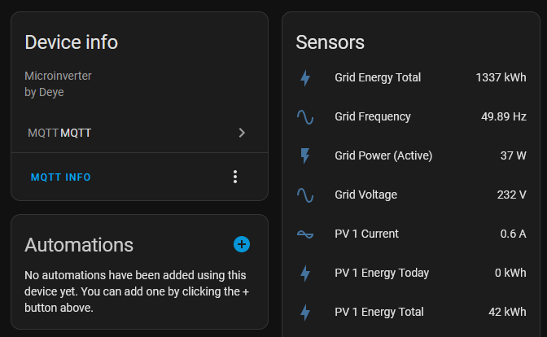

# Deye-dummycloud

This is a small Node.js service that mocks the deye solarman cloud and publishes all the data to an MQTT broker.
It also takes care of Home Assistant autodiscovery leading to things just working.



## Usage

The dummycloud is configured using environment variables to be container-friendly to use.

- `LOGLEVEL` (defaults to `info`)
- `MQTT_BROKER_URL` (no default. Should look like `mqtt://foo.bar`)
- `MQTT_USERNAME` (no default, optional.)
- `MQTT_PASSWORD` (no default, optional.)
- `MQTT_CHECK_CERT` set to `false` for using `mqtts` with self signed certificate (defaults to `true`)

## Inverter Setup

Using the `/config_hide.html` of the inverter webinterface, simply point `Server A Setting` and `Optional Server Setting` to the host this is running on.
I'd still keep the firewall rules preventing the inverter from phoning home in place for good measure.

## Deployment

The dummycloud can be started using `npm run start`. Next to this readme, there's also a dockerfile provided.

A `docker-compose.yml` entry could for example look like this:

```yml
  deye-dummycloud:
    build:
      context: ./deye-microinverter-cloud-free/dummycloud/
      dockerfile: Dockerfile
    container_name: "deye-dummycloud"
    restart: always
    environment:
      - "LOGLEVEL=info"
      - "MQTT_BROKER_URL=mqtt://foobar.example"
      # User those variables if the MQTT broker requires username and password
      # - "MQTT_USERNAME=example-user"
      # - "MQTT_PASSWORD=example-password"
    ports:
      - "10000:10000"
```
